# Homeowner App: High-Level Design (v1)

**Status:** design only. Nothing is built yet. This document turns `07-merged-plan.md` (the source of truth) and `06-founder-decisions.md` into an architecture. The companion `lld.md` has the schema, algorithms and Swift interfaces.
**Precedence:** where this document and the merged plan disagree, the merged plan wins until the founder approves the item in §9 *Deviations / assumptions for founder review*.
**Working names:** the app is called "Home" here, and Swift packages use the `Home*` prefix. Bundle ID `app.fumble.home` and iCloud container `iCloud.app.fumble.home` are placeholders.

---

## 1. Context, goals and non-goals

### 1.1 Context
This is a native iPhone app that uses the house's own floor plan as its navigation. Each floor is drawn like a listing plan, and pill tabs switch between floors. A single-select dropdown picks one of seven *views* (the code calls them **lenses**): Plan, To-Dos, Future Projects, Past Work, Appliances/Electronics/Furniture, Inventory and Budget. Every room has a "+" button. Behind the plan is a local SQLite database that syncs through the user's own iCloud.

### 1.2 Goals (v1)
| # | Goal | Measure |
|---|---|---|
| G1 | A usable plan in about 60 s (Rough it in), or an accurate one through Scan, Blocks or Trace | Rough-it-in onboarding under 60 s; any path under 10 min |
| G2 | The canvas feels native: crisp at every zoom level, 120 Hz pan and zoom | Frame budget in §5.4 |
| G3 | Four separate record kinds (Chores, Projects, Things, Inventory) plus Measurements, all tied to a place | Schema in LLD §3 |
| G4 | Chore reminders work with no server: local notifications plus EventKit calendar events (Apple, and Google accounts added on the device) | §4.7, LLD §9 |
| G5 | Budget is always computed from Projects and rolled up room → floor → property | LLD §8 |
| G6 | The app works fully offline, and data syncs across one person's devices through their private iCloud | §5.2, §5.3 |
| G7 | Finding things is easy: "where is my winter coat?" returns a location path | LLD §11–12 |
| G8 | Users own their data: CSV export of everything | LLD §13 |

### 1.3 Non-goals (v1)
- **No server, no accounts, no sign-in.** The Render account stays in reserve (§2) and nothing in v1 calls it.
- **No paywall or StoreKit code.** Every feature is free.
- **iPhone only, iOS 17.0 minimum.** No iPad layout (`UIDeviceFamily = [1]`), no Mac Catalyst, no Android and no web.
- **No household sharing across Apple IDs.** That arrives in v1.2 through `CKShare`. The design is sharing-ready (one CloudKit zone per property, §7 ADR-06). In v1, housemates are only labels (`person` rows).
- **No Home History Report, public-record lookups, MLS import, AI features, barcode scanning or grocery hand-off.**
- **No direct Google OAuth.** Google calendars are reached only through EventKit (ADR-05).
- **No editable doors or windows in geometry.** They are display-only markers (LLD §3.2 `opening`, §6.4 step 7).
- **No App Store release.** TestFlight only, for 2–5 testers. There is no analytics SDK.

### 1.4 Constraints and quality attributes
- **Users:** 2–5 TestFlight testers. The data is about 1 property per user, fewer than 15 levels, fewer than 80 spaces, and fewer than 10k records. A design that handles 10× that is enough.
- **Devices:** anything that runs iOS 17 (iPhone XS/XR and later). LiDAR is optional and checked at runtime with `RoomCaptureSession.isSupported`. Performance budgets are measured on the iPhone XS as the floor device and the iPhone 15 Pro as the 120 Hz device.
- **Privacy:** user content leaves the device only for the user's private iCloud, and it goes there encrypted (`encryptedValues`). The only other traffic is the coordinates sent to Overpass and Apple Maps for the exterior view.
- **Priorities:** UI quality first, then data safety, then everything else.

---

## 2. System context

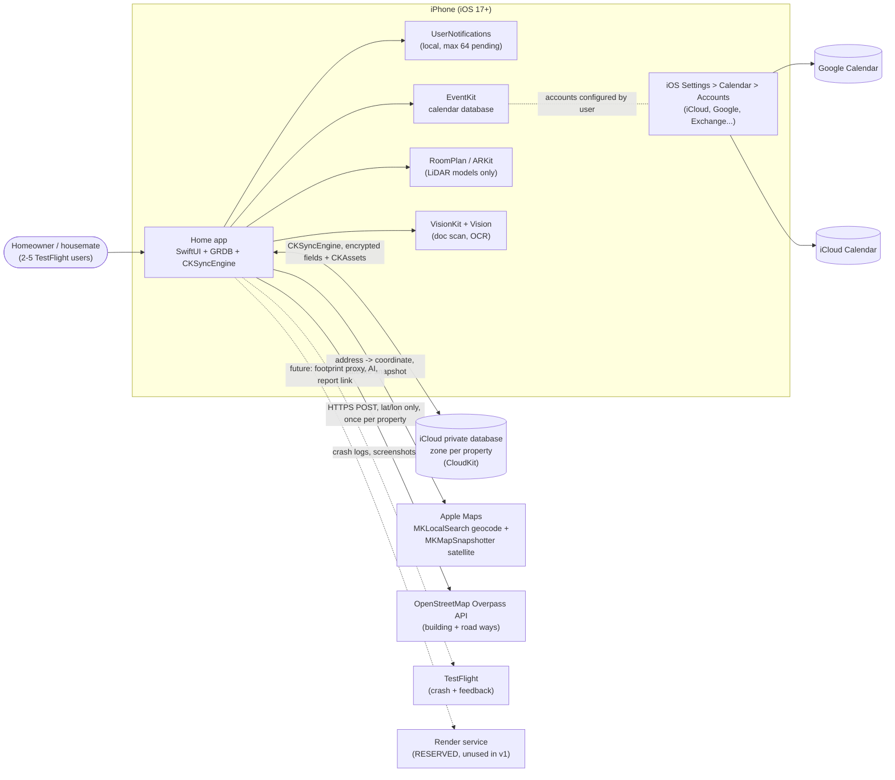

**Trust boundaries.** Three places outside the device receive data:
- **iCloud** gets all user data, in the user's own account.
- **Apple Maps** gets the address string and a coordinate.
- **Overpass** gets one coordinate. The `User-Agent` names the app and a contact email, as the OSM usage policy asks.

EventKit writes land in whichever calendar the user picks. The app does not control where those events sync after that; it is the user's calendar provider.

---

## 3. Component and module architecture

### 3.1 Layers
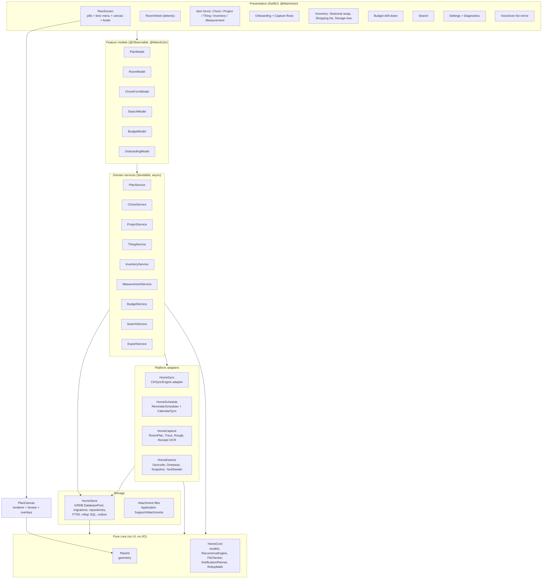

Rules:
- Views never touch GRDB directly. Feature models subscribe to GRDB `ValueObservation` streams through services.
- Pure packages (`PlanKit`, `HomeCore`) have no dependency on UIKit, SwiftUI, GRDB or CloudKit. Their tests run in seconds with no simulator (`swift test`).
- Every write goes through a repository. The repository writes the row, the sync outbox entry and the search index in **one transaction** (LLD §5.3, §12).
- **Side effects are post-commit reactions.** Notification replanning and calendar updates run after the transaction commits, triggered by a `DomainEvent` bus (an `AsyncStream`), so a failed EventKit call can never roll back data.

### 3.2 Swift packages (local SPM, one Xcode workspace)
| Package | Responsibility | Depends on |
|---|---|---|
| `PlanKit` | `Vec2`, `Polygon` in inches, validation, area, point-in-polygon, polylabel ("+" placement), snapping, tolerance weld, shared-edge wall derivation, squarified-treemap rough-in, RoomPlan-agnostic conversion math, local tangent-plane projection | `Clipper2Bridge` (vendored Clipper2 C++ behind a C shim, for offset/union/overlap) |
| `HomeCore` | Domain structs and enums (Level, Space, Chore, Project, Thing, InventoryItem, Measurement…), `RepeatRule`, `RecurrenceEngine`, `NotificationPlanner` (pure), `FitChecker`, season logic, money/format helpers | PlanKit |
| `HomeStore` | GRDB `DatabasePool`, `DatabaseMigrator`, record conformances, repositories, outbox, FTS5 `SearchIndexer`, rollup SQL, storage-tree CTEs, CSV `ExportService` | HomeCore, GRDB |
| `HomeSync` | `SyncCoordinator` (the `CKSyncEngineDelegate`), `RecordMapper`s, merge policy, orphan parking, account-change handling | HomeStore, CloudKit |
| `HomeSchedule` | `ReminderScheduler` (UNUserNotificationCenter diffing, 60-slot window, BGAppRefresh top-up), `CalendarSync` (EventKit, owner-device model) | HomeCore, HomeStore, UserNotifications, EventKit |
| `HomeCapture` | `RoomPlanImporter` (CapturedStructure → `PlanDraft`), `PhotoTraceCalibrator`, `RoughInGenerator`, `BlockTemplates`, `ReceiptReader` (VisionKit doc camera + Vision OCR) | PlanKit, HomeCore, RoomPlan, VisionKit, Vision |
| `HomeExterior` | `AddressResolver` (MKLocalSearch), `OverpassFootprintProvider`, `SatelliteSnapshotter` (MKMapSnapshotter, local cache), `YardSeeder` | PlanKit, MapKit |
| `PlanCanvas` | `PlanCanvasView` (SwiftUI `Canvas`), `Viewport`, gesture state machine, `LevelRenderModel` builder (off-main), the 7 `PlanLens` implementations, overlay layer ("+", chips, pins), accessibility children, editor overlays | PlanKit, HomeCore |
| App target `Home` | Composition root (`AppEnvironment`), feature screens, onboarding, Settings, Diagnostics, Info.plist, entitlements, privacy manifest | all |

The only third-party code is **GRDB** (MIT) and **Clipper2** (Boost license), plus **swift-snapshot-testing** in test targets only. The project does not use RevenueCat, Firebase or any analytics SDK.

### 3.3 Components the brief asks about
| Component | Design in one paragraph |
|---|---|
| **Plan geometry (PlanKit)** | Each space is a simple polygon in **inches** in level-local coordinates (x right, y down). Walls are never stored. They are derived at render time from shared polygon edges with a tolerance merge, and import-time welding makes edges coincide in the first place. The "+" button sits at the pole of inaccessibility. See LLD §6. |
| **Persistence (GRDB)** | One SQLite file in WAL mode (`DatabasePool`). Migrations are append-only and each is tested. Synced tables carry `created_at`, `updated_at` and `deleted_at` (soft delete). Sync bookkeeping lives in local-only tables, so domain rows stay clean. |
| **Sync (CKSyncEngine)** | Uses the private database, with one custom zone per property (`property-<uuid>`) and one record per row (recordName = row UUID). Fields go into `encryptedValues`. Merges are three-way overlays at column level, using the outbox's changed-field set (§5.3). Assets are uploaded as `CKAsset`. |
| **Capture** | Each of the four paths produces a `PlanDraft` value: Scan (RoomPlan `StructureBuilder`), Build with blocks (templates plus the editor), Trace (VisionKit document scan or PHPicker, with two-point scale calibration) and Rough it in (squarified treemap). One `PlanCommitter` writes any draft in a single transaction, so the rest of the app never knows which path was used. |
| **Exterior** | The address is geocoded with MKLocalSearch. Overpass returns the building ways and nearby road ways. The building polygon is projected to a local tangent plane in inches. A satellite snapshot is cached locally only and never synced to CloudKit (ADR-12). `YardSeeder` creates the six default zones in the footprint-aligned frame, with the front side facing the nearest road. |
| **Reminders (UserNotifications)** | A pure `NotificationPlanner` builds the desired set: occurrences over a 14-day horizon, round-robin across chores, capped at **60** requests plus 4 reserved slots. `ReminderScheduler` diffs that set against `pendingNotificationRequests()` using stable identifiers. The "Done" and "Snooze" notification actions complete a chore in the background. |
| **Calendar (EventKit)** | Needs full access (iOS 17 `requestFullAccessToEvents`). One recurring `EKEvent` per schedule-anchored chore, or one single event per completion-anchored chore. Each event carries a deep-link URL `home://chore/<uuid>` for dedupe. One **owner device** per chore manages events, so two devices never create duplicates. Google calendars work when the Google account is added in iOS Settings. See ADR-05 and LLD §9.5. |
| **Search** | A single FTS5 table (`porter unicode61`, prefix indexes 2 and 3) covers all record kinds. `SearchIndexer` maintains it in the same transaction, and it includes a denormalized **location path** column ("Attic › Shelf 2 › Bin Winter – Matt"). |
| **Export CSV** | One CSV per table (RFC 4180, UTF-8 with BOM), with human-readable location columns, zipped using `NSFileCoordinator(.forUploading)` and handed to the share sheet. |

### 3.4 Runtime and concurrency model
- `@MainActor` holds views and `@Observable` feature models.
- `DatabasePool` allows concurrent reads and serialized writes. Repositories are `Sendable` structs wrapping `any DatabaseWriter`.
- `SyncCoordinator` is an `actor`. CKSyncEngine calls into it and it writes through the same repositories with `origin: .sync`, so those writes do not re-enqueue.
- `ReminderScheduler` and `CalendarSync` are `actor`s. Each coalesces triggers with a 500 ms debounce.
- `LevelRenderModelBuilder` runs on a background task. It is rebuilt only when a level's geometry or the lens stats change, never on pan or zoom.

### 3.5 Data ownership
| Data | Where | Synced? |
|---|---|---|
| Domain rows (15 tables) | SQLite | Yes, via CloudKit, fields encrypted |
| Attachment binaries (photos, receipts, underlay images) | `Application Support/Attachments/<id>.<ext>` | Yes, as `CKAsset` |
| Satellite snapshot | `Caches/Snapshots/<levelId>.heic` plus region metadata in a local table | **No.** Each device regenerates it (ADR-12) |
| Sync state (engine serialization, record system fields, outbox, orphans) | SQLite, local-only tables | No |
| EventKit `eventIdentifier` cache | SQLite, local-only | No. The external identifier plus the deep-link URL do sync (via `chore_calendar_link`) |
| Pending notification set | iOS (UNUserNotificationCenter) | No. Derived and re-planned on every device |
| Preferences (last lens, units) | `UserDefaults` | No, except `property.default_level_id`, which syncs |
| FTS5 index, render caches | SQLite (FTS) and memory | No. Rebuildable |

---

## 4. Key data flows

### 4.1 Create plan: Scan (RoomPlan, LiDAR devices)
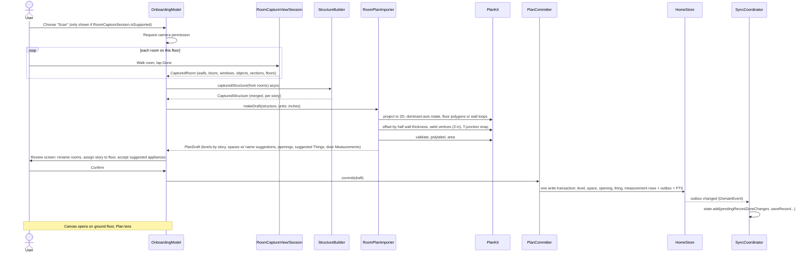

### 4.2 Create plan: Build with blocks
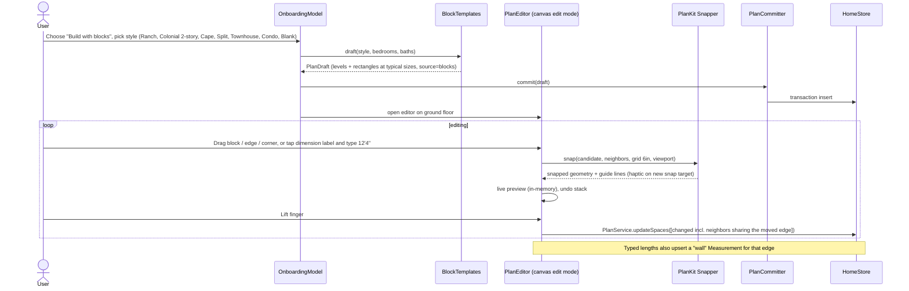

### 4.3 Create plan: Trace a photo
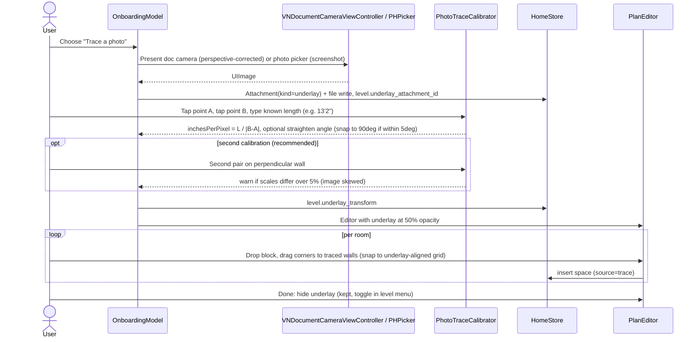

### 4.4 Create plan: Rough it in
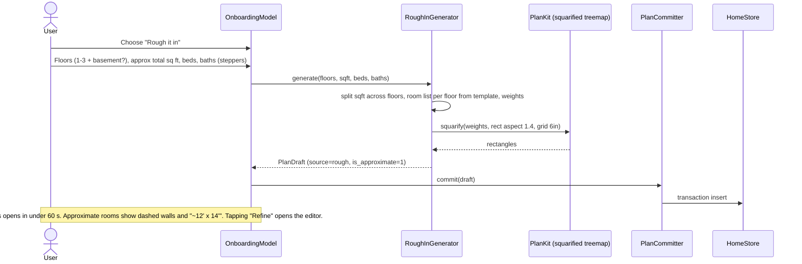

### 4.5 Exterior seeding (runs after any creation path when an address is known)
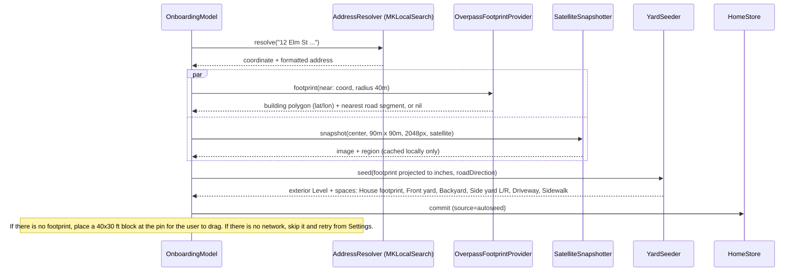

### 4.6 Add an item via "+"
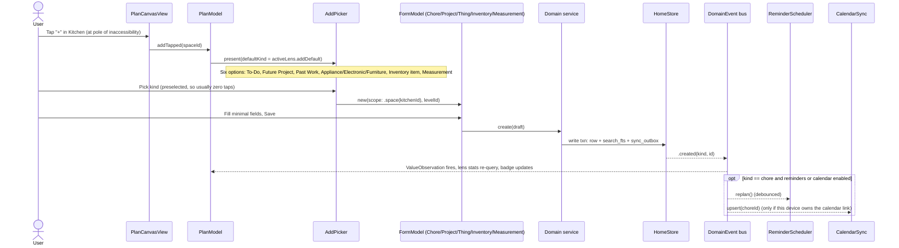

### 4.7 Complete a recurring chore
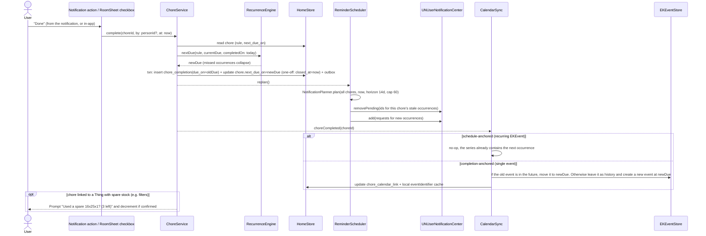

### 4.8 Mark a project Done → Past Work + budget rollup
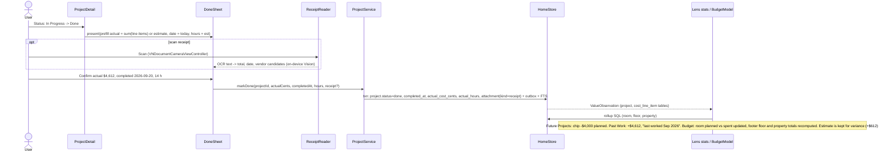

### 4.9 Fit check
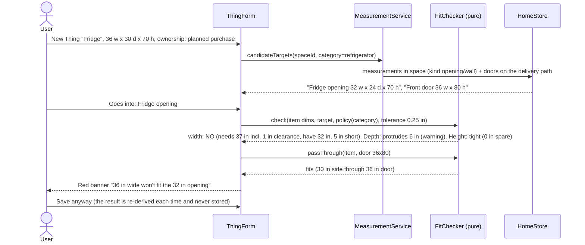

### 4.10 Sync across the user's devices
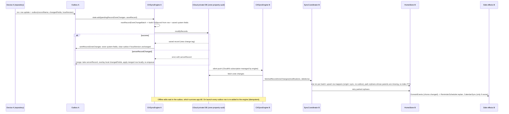

---

## 5. Cross-cutting concerns

### 5.1 Privacy and permissions
Every permission is requested **in context**, never at launch.

| Capability | Info.plist key / entitlement | Usage string (user-facing) | When requested |
|---|---|---|---|
| Camera (RoomPlan, doc scan, receipts, photos) | `NSCameraUsageDescription` | "Home uses the camera to scan rooms into a floor plan, capture a paper floor plan, and scan receipts and item photos." | The first time the user opens any camera flow |
| Calendar (full) | `NSCalendarsFullAccessUsageDescription` | "Home adds your chores to the calendar you choose, including Google calendars added to this iPhone, and updates or removes those events when you edit or delete a chore." | The first time a chore's "Add to calendar" is switched on |
| Calendar (legacy key, harmless) | `NSCalendarsUsageDescription` | Same text | Not requested separately |
| Notifications | none (runtime `requestAuthorization([.alert,.sound,.badge])`) | In-app pre-prompt: "Get a reminder when this chore is due?" | The first time a chore's reminder is switched on |
| Photo library | **none.** `PHPickerViewController` runs out of process and needs no key | none | none |
| Location | **none in v1.** The address is typed, and MKLocalSearchCompleter needs no location | none | none |
| iCloud | Entitlement: CloudKit, container `iCloud.app.fumble.home` | Shown in Settings as "Syncing with iCloud" | Implicit |
| Push | Entitlement `aps-environment` (for CKSyncEngine's silent pushes) | none | Implicit |
| Background | `UIBackgroundModes`: `remote-notification`, `fetch`. `BGTaskSchedulerPermittedIdentifiers`: `app.fumble.home.refresh` | none | none |
| Encryption export | `ITSAppUsesNonExemptEncryption = NO` | none | none |
| Privacy manifest | `PrivacyInfo.xcprivacy`: `NSPrivacyTracking=false`, no collected data types, required-reason APIs: UserDefaults `CA92.1`, file timestamps `C617.1` | none | none |

Data minimization rules:
- Overpass receives only a coordinate.
- MapKit receives the address and coordinate.
- CloudKit fields are written to `record.encryptedValues`, so they are end-to-end encrypted when Advanced Data Protection is on and encrypted at rest in either case.
- OCR, room classification and receipt parsing all run on the device.

### 5.2 Offline-first
- SQLite is the source of truth, and every feature works in airplane mode. Only three things need a network: first-time exterior seeding, satellite snapshots and sync.
- The outbox is durable. The sync status pill in Settings reads "Up to date", "Waiting for network" or "N changes pending".
- The first launch on a new device performs a **restore check** before onboarding: `syncEngine.fetchChanges()` runs with an 8 s timeout. If any `property-*` zone exists, the app shows "Restoring your home…" instead of the creation paths. This stops a second device from creating a duplicate property.
- **iCloud account changes:**
  - `signOut`: sync pauses and local data stays.
  - `switchAccounts`: a blocking sheet offers "Export CSV" and then "Erase local data and use the new account". The app never merges two Apple IDs' data.
  - `signIn` after a signed-out period: every row is enqueued.

### 5.3 Conflict resolution
**Model.** Each record merges with a *three-way overlay at column granularity*:
1. Start from the server record.
2. Overlay only the columns this device changed since its last successful send. The outbox stores the changed-column set, taken from GRDB `databaseChanges`.
3. Write the merged row locally and re-send it.

So a rename on the phone and a reshape on another device both survive. Only a true same-field race resolves to the later writer, and in that race it is the device that sends second.

**Exceptions** (full table in LLD §5.4):
- **Deletes win.** `deleted_at` is sticky unless the local side explicitly restored the record afterwards.
- **`chore.next_due_on` is re-derived** from the rule and the latest completion after every merge. It is never last-writer-wins (LWW).
- **Completions are append-only records**, so they never conflict. Duplicate completions of the same occurrence are both kept, and the next due date is computed from the latest.
- **Polygons are whole-value LWW.** Vertices are never merged.
- **`project.status` plus `completed_at`** are merged as a pair.

**Orphans.** A child record that arrives before its parent is parked in `sync_orphan` and retried after each batch. Foreign keys stay enforced.

### 5.4 Performance budgets
| Metric | Budget | Measured on | How |
|---|---|---|---|
| Cold launch to interactive canvas | ≤ 1.0 s (XS), ≤ 0.6 s (15 Pro) | XS, 15 Pro | `os_signpost` + MetricKit launch metrics |
| Canvas frame during pan/pinch (60 spaces, ~300 wall segments, 60 overlays) | ≤ 8 ms total, Canvas closure ≤ 4 ms | 15 Pro @120 Hz, XS @60 Hz | Instruments SwiftUI + Time Profiler |
| Lens switch (query + re-render) | ≤ 100 ms | XS | signpost |
| `LevelRenderModel` rebuild after a geometry edit | ≤ 30 ms | XS | signpost |
| Room sheet open (half detent visible) | ≤ 150 ms | XS | signpost |
| Rollup queries (room, floor, property) | ≤ 10 ms each at 10k rows | XS | XCTest `measure` |
| Search keystroke to results | ≤ 50 ms at 10k rows | XS | XCTest `measure` |
| RoomPlan structure → draft | ≤ 2 s per floor | 12 Pro | signpost |
| Notification replan | ≤ 150 ms for 200 chores | XS | XCTest `measure` |
| DB size | < 20 MB excluding attachments at 10k rows | – | – |
| Photo attachment | ≤ 3000 px long edge, HEIC q0.8 (~1 MB) | – | – |

Canvas techniques are in LLD §7:
- Transforms are applied to cached model-space paths, and strokes are drawn in screen space.
- Off-screen culling.
- Level-of-detail for labels.
- A resolved-text cache.
- Overlays are hidden while a gesture is in flight when more than 40 are visible.

### 5.5 Accessibility
- **The canvas exposes one accessibility element per space** (`.accessibilityChildren`), with this format: label "Kitchen", value "13 by 11 feet, 3 chores due this week, 1 overdue" (the value depends on the lens), and the actions "Open", "Add item" and "Rename".
- **VoiceOver list mirror.** A toolbar toggle swaps the canvas for a `List` grouped by level, then space, with the same lens stats. With VoiceOver on, this becomes the default.
- **Color is never the only signal.** An overdue room gets a red edge **and** a "!" badge. Budget tints come with a numeric chip, and the tint scale is color-blind-safe (a single-hue sequential ramp).
- **Dynamic Type everywhere outside the canvas.** Canvas labels scale with the Dynamic Type category up to 1.4× and then truncate with level-of-detail. The room sheet takes over at larger sizes.
- **Hit targets** are at least 44 × 44 pt. Small rooms get a 22 pt minimum hit radius (LLD §6.6). The "+" is 32 pt visible with a 44 pt hit area.
- **Reduce Motion** replaces zoom animations with cross-fades.
- **Haptics** are a snap tick in the editor and a success tap on chore completion. Both are off when the system turns haptics off.

### 5.6 Observability (no analytics SDK)
- **Logging:** `Logger(subsystem: "app.fumble.home", category:)` with the categories `sync`, `db`, `canvas`, `capture`, `exterior`, `schedule`, `calendar`, `export`. User content is marked `privacy: .private`.
- **Signposts** cover every budget in §5.4.
- **MetricKit:** an `MXMetricManagerSubscriber` writes daily payloads and diagnostics (crashes, hangs) into `Application Support/Diagnostics/`.
- **Diagnostics screen** (Settings › Diagnostics) shows:
  - iCloud account status, the last successful sync, the outbox count, parked orphans and the last sync error
  - pending notifications (x/64)
  - the calendar owner device and the calendar authorization state
  - DB size and schema version
  - an **Export diagnostics** button, which zips an `OSLogStore` 24 h slice, the MetricKit payloads and a counts-only JSON (no user content)
- **TestFlight** provides crash reports and screenshot feedback.

### 5.7 Testing strategy
| Layer | Tests | Tooling |
|---|---|---|
| PlanKit | Unit and property-style tests: area, point-in-polygon, polylabel, weld, wall derivation (golden fixtures), snapping, treemap, projection round-trip | XCTest / Swift Testing, fixtures as JSON |
| RoomPlan conversion | `CapturedStructure` is `Codable`. Real scans from 3+ homes (ranch, 2-story, open plan) are recorded on device, committed as JSON fixtures, and the converter output is compared against golden `PlanDraft` JSON plus snapshot images | Simulator-run unit tests |
| HomeCore | RecurrenceEngine with a fixed `Calendar` and time zone (including a DST week, Feb 29 and the 31st), NotificationPlanner (cap, fairness, horizon), FitChecker table tests | Swift Testing parameterized |
| HomeStore | Every migration from an empty DB **and** from a snapshot of each previous version, rollup SQL against seeded fixtures, CTE depth and cycle guard, FTS ranking, CSV golden files | In-memory `DatabaseQueue` |
| HomeSync | `SyncEngineProtocol` fake: two in-memory stores exchanging records, conflict matrix (field-disjoint edits, same-field, delete vs edit, orphan ordering), account switch | Unit |
| Schedule and calendar | Fakes for `NotificationCenterProtocol` and `CalendarStoreProtocol`. The diffing logic is tested without iOS services | Unit |
| Canvas | Snapshot tests of `LevelRenderModel` rendering per lens × light/dark × 3 fixture homes, plus viewport math tests | swift-snapshot-testing |
| UI | 5 XCUITest smoke flows: Rough-in onboarding, add chore via "+", complete chore, mark project done, search | XCUITest |
| Manual | A TestFlight checklist per build: real RoomPlan scan, Google calendar via iOS Settings, two-device sync, airplane-mode edits | Checklist in repo |

CI is GitHub Actions on a macOS runner and runs package tests plus app unit tests on each PR. UI tests run nightly.

---

## 6. Risks
| # | Risk | Likelihood | Impact | Mitigation |
|---|---|---|---|---|
| R1 | RoomPlan output is messy (gaps, open plans, stairs), so walls double or go missing | High | High | Import-time offset, weld and T-snap; render-time tolerance merge; a mandatory review screen; recorded-scan fixtures; editor always available |
| R2 | Hand-rolled CKSyncEngine mapping bugs lose or duplicate data | Medium | High | Sync built in Phase 1 alongside the schema, not at the end; outbox as source of truth; conflict-matrix tests; Diagnostics screen; CSV export as a safety net |
| R3 | Local-notification cap (64) and no background execution: daily chores stop reminding if the app isn't opened for about 2 weeks | Medium | Medium | 14-day horizon with round-robin fairness; BGAppRefresh top-up; a "sentinel" notification when the window is truncated ("Open Home to keep reminders coming") |
| R4 | EventKit duplicate or orphaned events across devices; `eventIdentifier` changes after a calendar re-sync | Medium | Medium | Owner-device model; deep-link URL on every event; lookup by external identifier, then by URL within a window |
| R5 | Google calendars via EventKit: can't create a "Home" calendar in a Google account; sync latency | High | Low | Suggest "Home" in iCloud; for Google, let the user pick an existing calendar |
| R6 | Overpass downtime, rate limits, or a missing or misaligned footprint | Medium | Low | 1 call per property, with cache; fallback block; user drags the footprint; Render proxy is reserved |
| R7 | Apple Maps snapshot storage terms | Low (5 users) | Medium (public) | Snapshot cached only locally and regenerable; review terms before any public release |
| R8 | Canvas perf on an XS with large plans plus many SwiftUI overlays | Low | Medium | Budgets in §5.4; overlay culling and hiding during gestures; fallback to per-space `CAShapeLayer` behind the same `PlanRenderer` interface |
| R9 | Scope creep from the inventory screens (pantry, clothing) | Medium | Medium | Fixed field sets in v1; no barcode or AI |
| R10 | Onboarding friction | Medium | High | Rough it in as the default suggestion for non-LiDAR phones; items can be added before geometry is exact |
| R11 | Unit and precision drift (feet-inches parsing, metric users) | Low | Low | Inches stored as Double; one parser/formatter; property tests |

---

## 7. Decisions record (ADR-style)

**ADR-01. GRDB/SQLite over SwiftData.**
- **Decision:** GRDB 7 (or the current stable release) with an explicit SQL schema.
- **Rationale:**
  - We need real SQL aggregates (budget rollups), recursive CTEs (storage tree), FTS5 (search), JSON functions (template attributes such as "all 16x25x1 filters") and predictable, testable migrations.
  - SwiftData's CloudKit mode has no `CKShare` or shared-database support, which would block v1.2 sharing. It also forbids unique constraints and forces optional relationships.
- **Cost:** we write our own sync mapping (ADR-02).

**ADR-02. CKSyncEngine with a column-level three-way overlay.**
- **Decision:** CKSyncEngine (iOS 17) against the private DB.
- **Rationale:** the engine owns scheduling, push subscriptions, batching and retry. We own the mapping and merging.
- **Rejected alternatives:**
  - `NSPersistentCloudKitContainer` (Core Data, a second persistence stack)
  - a custom server (founder: no server in v1)
  - a third-party sync SDK

**ADR-03. One project record with a status (idea → planned → in progress → done).**
- **Decision:** a single record; Future Projects and Past Work are both views of it.
- **Rationale:**
  - It keeps photos, line items and the estimate next to the actual, which the future History Report needs ("planned $4k, spent $4.6k").
  - Chores are now their own kind, so the argument for a linked pair (keep the to-do that led to the work) is gone. `spawned_from_chore_id` keeps the lineage.

**ADR-04. Four item tables plus Measurement, not one unified table.**
- **Decision:** `chore`, `project`, `thing` and `inventory_item` are separate tables. They share `attachment` (polymorphic) and one FTS index.
- **Rationale:**
  - Their lifecycles differ: chores repeat, projects carry cost, things carry specs and dimensions, inventory carries quantity, owner and location.
  - One table would need about 40 nullable columns plus CHECK soup.
  - Cross-kind features (search, "+", room sheet) go through the shared index and a small `ItemRef` enum.

**ADR-05. EventKit for Apple and Google calendars, no Google OAuth.**
- **Decision:** write chore events through EventKit with full access. Google calendars added in iOS Settings › Calendar › Accounts appear as ordinary `EKCalendar`s.
- **Rationale:**
  - No server, no OAuth verification, no token storage.
  - One owner device per chore manages the events, so a user with two devices doesn't get duplicates.
- **Deferred:** direct Google sign-in, for users who haven't added Google to iOS.

**ADR-06. One CloudKit zone per property, in the private database.**
- **Decision:** zone name `property-<uuid>`, recordName = row UUID.
- **Rationale:** v1.2 household sharing becomes a zone-wide `CKShare` with no data migration, and each property's data is isolated.

**ADR-07. Direct OSM Overpass instead of hosted Microsoft footprints.**
- **Decision:** call the public Overpass endpoint from the phone, once per property.
- **Rationale:**
  - At 2–5 users this is well inside the usage policy.
  - Hosting 130M MS footprints is a data-engineering and ODbL-obligation project that only pays off at public scale.
- **Fallbacks:** a user-dragged block; a Render proxy later behind the same `FootprintProvider` protocol. Attribution "© OpenStreetMap contributors" is shown on the exterior level.

**ADR-08. Geometry in inches (Double), level-local, y-down; walls derived rather than stored.**
- **Rationale:**
  - The founder's measurements are imperial ("32 inches").
  - Integer-like values display cleanly.
  - Deriving walls means room edits can't leave walls out of sync.
- **The derivation must be robust:** import-time weld plus a render-time tolerance merge (LLD §6.4).

**ADR-09. SwiftUI `Canvas` with a model-space viewport, not a zoomed `UIScrollView`.**
- **Rationale:** vectors and text are re-rendered at every scale, so they stay crisp. Hit-testing happens in model space.
- **Interactive pieces:** "+", chips and pins are SwiftUI overlays positioned through the viewport.
- **Fallback:** per-space `CAShapeLayer` behind the same renderer protocol.

**ADR-10. Lenses are code, not data.**
- **Decision:** each of the 7 dropdown views is a `PlanLens` value defining predicate, badge, tint, edge, pins, footer and add-default.
- **Rationale:** no migration is needed to tune a lens, and user-defined lenses are a v2 idea.

**ADR-11. Budget is computed, never stored.** Rollups are SQL over `project` and `cost_line_item` at query time. At fewer than 10k rows they take under 10 ms, and there is no cache to invalidate.

**ADR-12. The satellite snapshot is a local cache, not synced data.**
- **Rationale:** lowers the Apple Maps terms risk and keeps big binaries out of iCloud. Each device regenerates it from the stored georeference.

**ADR-13. Local notifications use a planned rolling window.** A pure `NotificationPlanner` plus a diffing scheduler, with a 60 + 4 slot budget and a 14-day horizon. It respects the iOS 64-pending cap and needs no push server.

**ADR-14. Soft delete with a 30-day "Recently Deleted".** `deleted_at` syncs as a field, and a hard purge (local plus the CloudKit record) happens after 30 days. This allows undo, and "delete wins" merges are simple.

**ADR-15. No third-party analytics.** OSLog, MetricKit, TestFlight and a Diagnostics export are enough for 5 testers and match the privacy positioning.

**ADR-16. Clipper2 for polygon boolean and offset operations.** Hand-writing offset and union for RoomPlan cleanup and room split/merge is a bug farm. Clipper2 is battle-tested, and we call it through a tiny C shim with integer coordinates at 1/100 in.

**ADR-17. One `PlanDraft` contract for all four creation paths.** Every path produces a value type, and a single committer writes it. Tests cover each path's draft without touching the database.

**ADR-18. Floating local dates for chores.** `next_due_on` is a local calendar date (`YYYY-MM-DD`) plus minutes after midnight, not an absolute instant. Time zone and DST changes then don't shift "every Tuesday at 7 pm".

---

## 8. Phase mapping (ordered, no dates)
| Merged-plan phase | Design components that land |
|---|---|
| 0. Design | Mockups (a separate workstream); this HLD and LLD |
| 1. Plan core | PlanKit, HomeStore schema v1 (all tables, so sync mapping is designed once), **HomeSync basic save/fetch** (moved earlier from Phase 4, ADR-02), PlanCanvas and Plan lens, the 4 creation paths, HomeExterior, Settings (default floor) |
| 2. Tracking core | Chore/Project/Thing/Measurement services, the 7 lenses, RecurrenceEngine, ReminderScheduler, CalendarSync, FitChecker, rollups, ReceiptReader, FTS search, CSV export |
| 3. Inventory | Storage tree, persons, clothing and seasonal swap, pantry and shopping list |
| 4. TestFlight | Sync hardening (conflict matrix, orphans, account switch), Diagnostics, perf pass against §5.4, accessibility audit |

---

## 9. Deviations / assumptions for founder review

These are places where this design extends the merged plan or picks something it left open. Each is a default that can be reversed; none needs a server or adds a paywall.

1. **Sync is built in Phase 1, not hardened only in Phase 4.** The basic CloudKit save and fetch ships with the schema in Phase 1, and Phase 4 keeps the hardening. *Why:* both planners' reviews warned that sync bolted on late breaks schemas.
2. **Geometry is in inches.** The merged plan doesn't say which unit. Metric display is a Settings toggle.
3. **Repeat rules gain two small extensions.**
   - *Weekly* can pick specific weekdays (e.g. trash on Tue and Fri).
   - *Monthly* takes an interval, so every 12 months covers yearly jobs like detector batteries.
   - Every rule has an **anchor**: "on schedule" (the default for daily, weekly and monthly) or "after completion" (the default for every-N-days, e.g. "filter 90 days after last change").
4. **Missed occurrences collapse.** Completing a daily chore that is 3 days overdue schedules tomorrow; it doesn't stack 3 overdue items. There is also a "Skip" action that advances without logging the chore as done.
5. **One device manages calendar events for a chore.** The device that switched on "Add to calendar" owns its events. Other devices of the same user leave the calendar alone, because the calendar provider already syncs the events. Settings has a "Manage calendar events on this iPhone" hand-off.
6. **Calendar needs *full* access, not write-only.** Write-only access can't update or delete events, and the founder asked for edits and deletes to carry over.
7. **Google calendar caveat.** The suggested "Home" calendar can be created in iCloud. iOS generally can't create new calendars inside a Google account through EventKit, so Google users pick one of their existing Google calendars.
8. **Notification window.** Up to 60 upcoming chore reminders are kept scheduled over the next 14 days, and a background refresh tops them up. If someone has more than about 60 reminders due in two weeks and doesn't open the app, the furthest-out ones are delayed until the next open. A final "Open Home to keep reminders coming" notice fires if that happens.
9. **Pantry expiry digest.** An extension: one daily 9 am notification when pantry items expire within 3 days ("3 items expire soon"). It uses one of the 4 reserved notification slots. Off by default.
10. **Things get an ownership state: Owned or Planned purchase.** This supports the founder's "plan to buy one" fit check. Planned things show dashed on the canvas and are excluded from counts.
11. **Things can point at the space they go into** (`fit_measurement_id`, e.g. "Fridge opening"). Measurements gain a `kind` (opening, wall, door, window, zone, general). One door can be flagged **"delivery path"** for pass-through checks.
12. **Fit-check clearances** use a small default table per category (e.g. fridge: 1 in total width, 1 in top, 1 in back; furniture: 0), which the user can edit per item. Fridges deeper than the opening produce a warning, not a failure. The result is computed each time and never stored.
13. **Doors and windows can be added by hand in edit mode, display-only**, as markers on a wall with a width. Without that, non-LiDAR users would have nothing to hang a door Measurement on. This doesn't change room geometry.
14. **Default floor is stored as `property.default_level_id`** (one synced setting) rather than an `isDefault` flag on each level. This avoids two-devices-two-defaults conflicts.
15. **Budget definitions.**
    - **Planned** = estimates of projects that are *Planned* or *In Progress*. *Ideas* are shown separately as "Ideas $" and not counted as planned.
    - **Spent** = the actual cost (or the line-item sum if the actual is blank) for *In Progress* and *Done* projects.
    - Estimate vs. actual variance is shown for Done projects.
    - Hours roll up the same way.
16. **Rough-it-in rooms are marked approximate.** They draw with dashed walls and "~" dimensions until the user edits them. Room size weights come from a fixed table (LLD §6.10).
17. **Exterior orientation uses the nearest road.** The same Overpass call fetches roads within 60 m, so the Front yard faces the street. If none is found, the front is the bottom of the screen and the user can rotate it.
18. **Satellite image is not synced.** Each device re-downloads it (ADR-12).
19. **Seasonal swap uses the property's hemisphere.** "Upcoming season" is derived from the date and the property latitude (Mar–May → Summer is upcoming, Sep–Nov → Winter is upcoming, in the northern hemisphere). The merged plan's three seasons (Summer, Winter, All-year) are kept.
20. **Spare-stock prompt.** An extension: completing a chore linked to an appliance with spare stock (e.g. filters) asks "Used a spare? (3 left)" and decrements the Inventory item.
21. **Recently Deleted, 30 days.** Deletes are recoverable for 30 days. When a room is deleted, the user chooses where its items go (another room, or floor-wide).
22. **Changing iCloud accounts** never merges data. The app offers a CSV export, then erases local data for the new account.
23. **No location permission.** The address is always typed. "Use my current location" can come later.
24. **CSV export** is a zip of one CSV per record kind, not a single sheet.
25. **No analytics SDK.** The app uses TestFlight, Apple crash reports and an opt-in "Export diagnostics" file the tester can send.
26. **Scanned multi-floor alignment.** If floors are scanned in separate sessions, the user aligns them with two matching points (e.g. the stairs). Floors scanned in one session are auto-aligned by RoomPlan.
27. **CloudKit fields are encrypted** (`encryptedValues`) by default. There's no downside at this scale, and it strengthens the "your home data stays yours" message.
